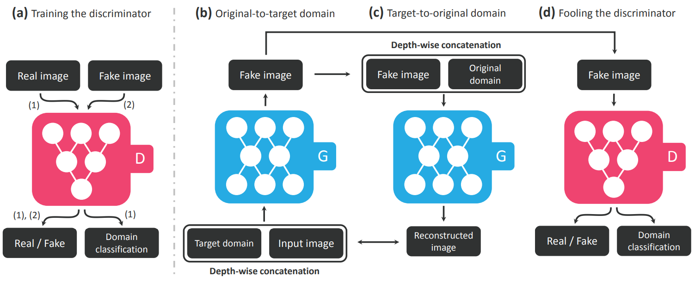
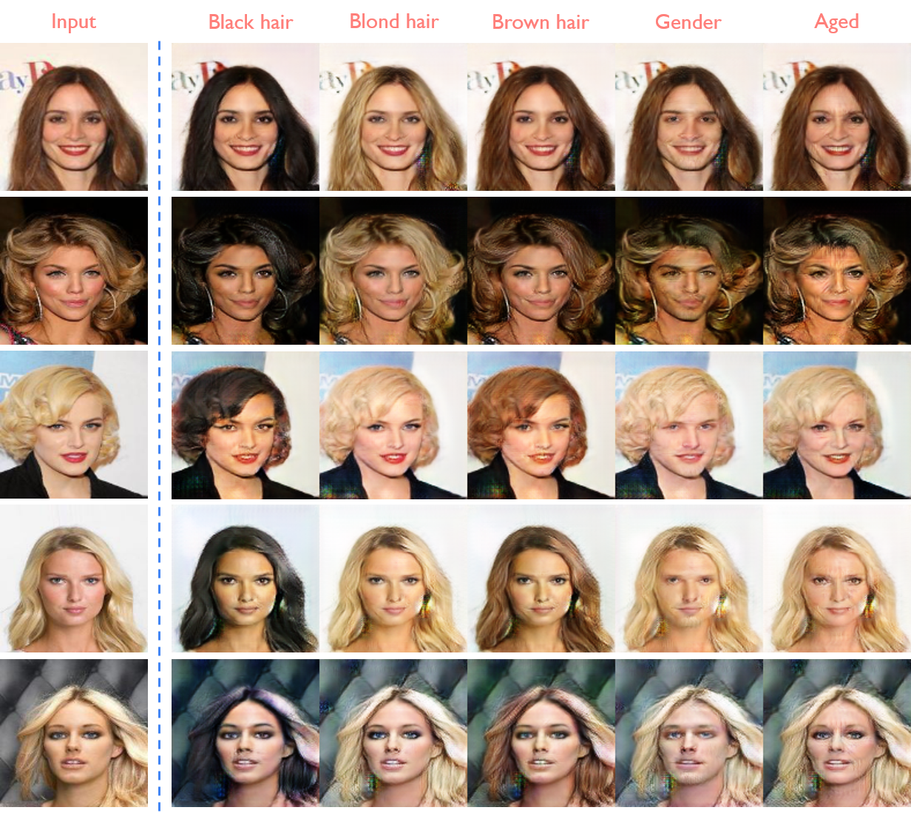
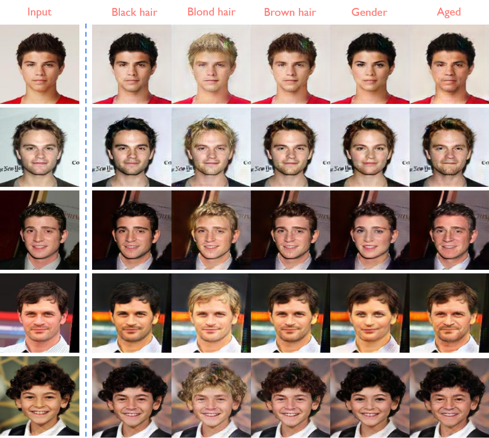

<p align="center"></p>

--------------------------------------------------------------------------------
## Requirements
* Tensorflow 1.8
* Python 3.6

```python
> python download.py celebA
```

## Usage
### Downloading the dataset
```python
> python download.py celebA
```

```
├── dataset
   └── celebA
       ├── train
           ├── 000001.jpg 
           ├── 000002.jpg
           └── ...
       ├── test
           ├── a.jpg (The test image that you wanted)
           ├── b.png
           └── ...
       ├── list_attr_celeba.txt (for attribute information) 
```

### Train
* python main.py --phase train

### Test
* python main.py --phase test 

### Pretrained model
* Download [celebA_checkpoint](https://drive.google.com/open?id=1ezwtU1O_rxgNXgJaHcAynVX8KjMt0Ua-)

## Summary


## Results
### Women


### Men


## Author
Junho Kim
